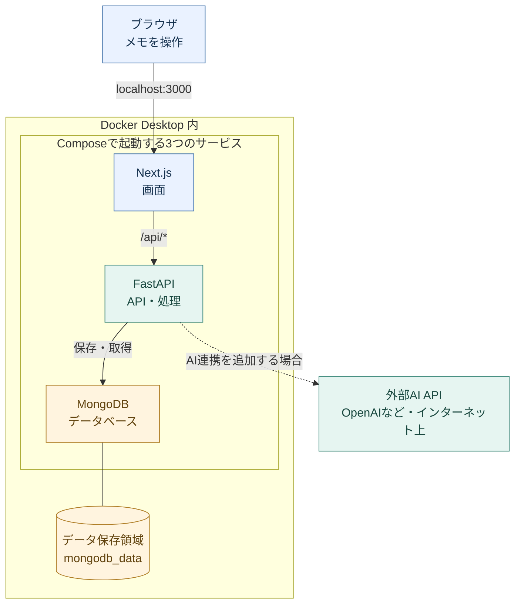

# 森本研究室 システム開発スターター

**最終更新日時：2026-10-08 21:00（日本時間／JST）**

**更新者：中沢尚也**

**研究システムづくりの共通ひな形**

森本研究室のメンバーが各自の研究システムを作るための、共通の開発用ひな形です。
Next.js（画面）・FastAPI（API）・MongoDB（データベース）の3サービスを、Docker Composeでまとめて起動します。
サンプル機能は「メモの保存・一覧表示」です。研究システムでのAI利用も想定し、[OpenAI APIとの連携を追加する手順](docs/ai-integration.md)を用意しています。AIの接続処理や認証は、各研究用プロジェクトで追加します。

## システム構成

**基本の3サービスは各メンバーのMac・Windowsで動き、AI連携を追加すると外部のAI APIへ接続します。**
Docker Composeが、画面・API・データベースの3つをまとめて起動します。



矢印は依頼の流れです。処理結果は同じ経路を逆向きに戻り、ブラウザに表示されます。
**外部AIへ向かう点線は追加実装する部分で、現在のStarterでは未接続です。**
図が表示されない環境では、**ブラウザ → Next.js → FastAPI → MongoDB** の順に読み進めてください。

### メモを保存するときの流れ

1. ブラウザでメモを入力し、保存ボタンを押します。
2. Next.jsが `/api/samples` への依頼をFastAPIへ転送します。
3. FastAPIが入力内容を確認し、MongoDBへ保存します。結果が画面へ戻り、メモの一覧が更新されます。

| 部分 | 役割・接続先 | 対応する設定・ファイル |
| --- | --- | --- |
| Next.js（`frontend`） | 画面の表示。ブラウザから `http://localhost:3000` で開く | `frontend/src/app/` |
| FastAPI（`backend`） | メモの保存・取得。Next.jsから内部の `http://backend:8000` へ接続 | `backend/app/`、`frontend/next.config.mjs` |
| MongoDB（`mongodb`） | メモのデータベース。FastAPIから内部の `mongodb://mongodb:27017` へ接続 | `backend/app/db.py`、`compose.yaml` |
| データ保存領域 | `mongodb_data` という名前付きボリュームを、MongoDBの `/data/db` に接続 | `compose.yaml` の `volumes` |

- ポート番号は初期設定です。画面とAPIは自分のPCからだけアクセスでき、MongoDBのポートはPC側へ公開していません。APIを直接試す場合は `http://localhost:8000/api/docs` を開けます。
- 3つのサービスはComposeの共通ネットワークで接続します。データ保存領域はコンテナと別に管理され、通常の `docker compose down` ではメモが残ります。
- **GitHubはプログラムの共有・変更履歴の管理に使います。** メモは各自のPC内に保存されます。GitHub Desktopは取得・更新を助ける任意のアプリで、上の実行構成には含まれません。

この図は [compose.yaml](compose.yaml)、[Next.jsの転送設定](frontend/next.config.mjs)、[MongoDBの接続処理](backend/app/db.py) に基づいています。Dockerでの一括起動などの確認状況は、[動作確認状況](#動作確認状況)を参照してください。

### 構成図の参考資料

参照日：2026-10-08。以下を参考に、このひな形の設定に合わせて作図しました。

- [Docker公式：Composeの構成図とアプリケーションモデル](https://docs.docker.com/compose/intro/compose-application-model/#illustrative-example)：サービスの範囲、通信、データ保存領域を分けて示す表現を参考にしました。
- [GitHub：docker/awesome-compose の React・Express・MongoDBの例](https://github.com/docker/awesome-compose/tree/master/react-express-mongodb)：画面・API・MongoDBを3サービスとして整理する構成を参考にしました。このひな形では、画面にNext.js、APIにFastAPIを使います。
- [GitHub公式：Markdownに図を記載する方法](https://docs.github.com/en/get-started/writing-on-github/working-with-advanced-formatting/creating-diagrams)：README内で編集できるMermaid形式を採用しました。

## AI連携を追加する場合

研究システムでAIを使う場合は、**[AI連携の追加手順（OpenAI APIの例）](docs/ai-integration.md)** を参照してください。Mac・Windowsで共通の手順です。

- 構成：ブラウザ → Next.js → FastAPI → OpenAI API。
- 設定：APIキーは各自の `.env` に保存し、backendだけへ渡します。
- 実装例：公式Python SDKのResponses APIを使った、短い文章の送信・回答取得。
- 他社API：AIを呼び出すファイルを中心に、認証・SDK・入出力の形式を変更します。

**手順とコード例を追加した段階で、AI機能はまだStarterに組み込まれていません。** キーの入力だけでは有効にならないため、手順書に沿って設定・ファイル・APIの登録を追加してください。参考GitHub・公式サイト、料金とデータ送信の確認事項も同じページにまとめています。

## まず、自分のOSの手順を開いてください

| 利用するPC | 詳しい手順 |
| --- | --- |
| Mac | **[Mac用の利用手順](docs/setup-mac.md)** |
| Windows | **[Windows用の利用手順](docs/setup-windows.md)** |

[更新履歴（CHANGELOG.md）](CHANGELOG.md)では、ひな形と手順書の変更点を日付別に確認できます。

それぞれの手順書に、次の内容をまとめています。

1. 必要なアプリの準備（WindowsはWSL 2の設定を含む）
2. 共通ひな形から自分の非公開リポジトリを作成
3. PCへ取得し、設定ファイルを準備
4. 起動してメモの保存を確認
5. 画面を編集し、変更をGitHubへ保存
6. 終了・翌日の再開・困ったときの対処

**GitHub Desktopは任意です。** 各OSの手順書から、次の取得方法を選べます。編集はVS Codeを例にし、起動コマンドはMacではターミナル、WindowsではPowerShellに入力します。

| 取得方法 | GitHub Desktop | 使い方 |
| --- | --- | --- |
| A：GitHub Desktop | 使用する | 画面操作で取得・変更履歴の保存を行う |
| B：ZIP | 不要（Gitも不要） | 公開ひな形をダウンロードして、まず起動する |
| C：Gitコマンド | 不要 | Gitで取得・変更履歴の保存を行う。認証例にはGitHub CLIを使う |

GitHub Desktopを使わない手順へのリンク：

- Mac：[ZIPで取得](docs/setup-mac.md#4b-zipで取得する) ／ [Gitコマンドで取得](docs/setup-mac.md#4c-gitコマンドで取得する)
- Windows：[ZIPで取得](docs/setup-windows.md#5b-zipで取得する) ／ [Gitコマンドで取得](docs/setup-windows.md#5c-gitコマンドで取得する)

ZIPで試すだけなら、自分用リポジトリの作成とGitHubへの保存は省略できます。Docker Desktopは、どの方法でも起動に必要です。
Node.js・Python・MongoDBをPCへ個別に入れる必要はありません。MAMPとは独立して使えます。

この共通ひな形と手順書は公開しています。閲覧に招待やGitHubへのログインは不要です。
自分の研究用リポジトリを作るときはGitHubへログインし、公開範囲を **Private** にします。

## 準備済みの方の起動・停止

Docker Desktopを起動し、`.env` を準備済みであることを確認します。
`compose.yaml` がある自分のプロジェクトのフォルダで実行してください。

```text
docker compose up --build
```

| 用途 | URL |
| --- | --- |
| サンプル画面 | [http://localhost:3000](http://localhost:3000) |
| APIの仕様・試行画面 | [http://localhost:3000/api/docs](http://localhost:3000/api/docs) |
| 接続確認 | [http://localhost:3000/api/health](http://localhost:3000/api/health) |

「API・データベース接続済み」と表示されたら、テスト用のメモを1件保存します。
ブラウザを再読み込みしてメモが残っていれば、画面・API・データベースの接続を確認できます。

停止するときは起動中の画面で **Control + C（WindowsではCtrl + C）** を押し、停止完了後に次を実行します。

```text
docker compose down
```

保存したメモは専用ボリュームに残ります。**`docker compose down -v` はデータも削除するため、通常の停止には使いません。**
次回は同じフォルダで `docker compose up` を実行して再開します。

## どこを編集するか

```text
morimoto-lab-starter/
├── frontend/
│   ├── src/app/
│   │   ├── page.tsx           # サンプル画面
│   │   ├── layout.tsx         # 共通レイアウト
│   │   └── globals.css        # 見た目
│   ├── Dockerfile
│   ├── .dockerignore
│   ├── next.config.mjs        # /api/* をFastAPIへ転送
│   ├── package.json
│   ├── package-lock.json
│   └── tsconfig.json
├── backend/
│   ├── app/
│   │   ├── __init__.py
│   │   ├── main.py            # APIの起点・接続確認
│   │   ├── db.py              # MongoDB接続
│   │   └── routes/
│   │       ├── __init__.py
│   │       └── sample.py      # メモの保存・取得
│   ├── Dockerfile
│   ├── .dockerignore
│   └── requirements.txt
├── docs/
│   ├── setup-mac.md           # Mac用の利用手順
│   ├── setup-windows.md       # Windows用の利用手順
│   └── ai-integration.md      # AI連携を追加する場合の手順
├── compose.yaml
├── .env.example              # 各自が.envへコピーして使う
├── .gitignore
├── CHANGELOG.md              # ひな形と手順書の更新履歴
└── README.md
```

- 画面を作る：`frontend/src/app/` を編集します。
- APIを作る：`backend/app/routes/` にファイルを追加し、`main.py` に登録します。
- `frontend/src` と `backend/app` は、起動中のコンテナへ変更が共有されます。Windowsでは自動更新されない場合があるため、[Windows用手順の編集方法](docs/setup-windows.md#8-画面を1か所編集してみる)も確認してください。
- `package.json`・`package-lock.json`・`requirements.txt`・Dockerfile・`next.config.mjs` などの変更後は、停止して `docker compose up --build` で再ビルドします。
- `.env` は各自の設定で、Gitには含まれません。共有する設定項目は、秘密の値を入れず `.env.example` に記載します。

GitHubにはプログラムと変更履歴を保存します。MongoDB内のメモは含まれないため、実際の研究データには別途バックアップが必要です。

## API

| メソッド | パス | 内容 |
| --- | --- | --- |
| GET | `/api/health` | API・MongoDBの接続確認 |
| GET | `/api/samples` | 新しい順に最大20件のメモを取得 |
| POST | `/api/samples` | `{"text": "テストメモ"}` を保存 |

メモは前後の空白を除いて1〜500文字です。
ブラウザからは同じオリジンの `/api/*` に接続し、Next.js経由でFastAPIへ転送します。
FastAPIへ直接接続する場合は [http://localhost:8000/api/docs](http://localhost:8000/api/docs) を使えます。

## 利用範囲と設定

このひな形は自分のPCでの開発用です。画面とAPIは `127.0.0.1` に限定し、MongoDBのポートはPC側へ公開しません。
認証は未実装なので、実際の研究データの収集やサーバー公開の前に、必要な認証・アクセス制御を追加してください。

ポートが使用中の場合は、`.env` の `FRONTEND_PORT` と `BACKEND_PORT` を別の番号（例：3001・8001）に変更し、再起動します。ブラウザのURLも変更後の番号に合わせます。

複数の研究プロジェクトを動かす場合は、異なるフォルダ名・異なるポートを使います。
Composeのプロジェクト名とデータ用ボリュームは、フォルダ名を基に分かれます。同じフォルダ名を使う場合は `docker compose -p 名前 ...` でプロジェクト名を明示し、起動・状態確認・停止で同じ名前を指定します。
すでにデータがあるプロジェクトのフォルダ名を変更する場合は、保存領域との対応にも注意してください。

## 管理者の配布手順

1. この共通ひな形をGitHubの公開リポジトリとして配置します。
2. リポジトリのSettingsで **Template repository** を有効にします。
3. リポジトリのURLと各OSの手順書をメンバーへ案内します。閲覧・取得のための招待は不要です。
4. 共通ひな形を共同編集するメンバーには、必要に応じて書き込み権限を付与します。

メンバーが自分のアカウントに作った非公開の研究用リポジトリを管理者も閲覧する場合は、そのリポジトリへの招待が別途必要です。

## 動作確認状況

2026年10月8日時点で、次を確認しています。

- Mac上でNext.jsの型チェック・本番ビルド、FastAPI・MongoDBと連携したメモの保存・取得を確認。
- データベース再起動後のデータ保持、入力エラー、接続できない場合の動作を確認。
- Docker Composeの設定ファイルを検証。

**Docker Desktopによる一括ビルド・起動と、Windows実機での実行は未確認です。**
OS別手順は公式資料とこのリポジトリの設定に基づくもので、両OSの実機検証完了を示すものではありません。

## 技術資料

- [Next.js：基本構成と起動](https://nextjs.org/docs/app/getting-started/installation)
- [FastAPI：接続の開始・終了を管理するlifespan](https://fastapi.tiangolo.com/advanced/events/)
- [MongoDB：PyMongoの接続](https://www.mongodb.com/docs/languages/python/pymongo-driver/current/connect/mongoclient/)
- [Docker Compose：起動順序とhealthcheck](https://docs.docker.com/compose/how-tos/startup-order/)

インストールやGitHubの操作に関する公式資料は、各OSの手順書から参照できます。
